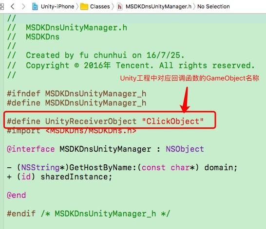
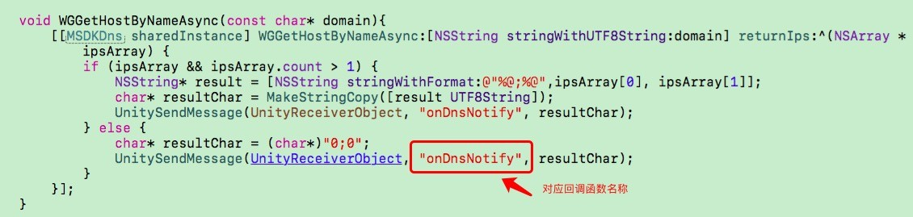

# HTTPDNS iOS客户端接入文档（腾讯云客户专用） #
----
**本接入文档供腾讯云客户参阅**

**腾讯内部业务，请参阅文档[HTTPDNS iOS客户端接入文档（腾讯内部业务专用）.md](https://github.com/tencentyun/httpdns-ios-sdk/blob/master/HTTPDNS%20iOS%E5%AE%A2%E6%88%B7%E7%AB%AF%E6%8E%A5%E5%85%A5%E6%96%87%E6%A1%A3%EF%BC%88%E8%85%BE%E8%AE%AF%E5%86%85%E9%83%A8%E4%B8%9A%E5%8A%A1%E4%B8%93%E7%94%A8%EF%BC%89.md)**
## GitHub目录结构说明

| 目录名称       | 说明           | 适用范围  |
| ------------- |-------------| -------------|
| HTTPDNSDemo | iOS客户端使用HttpDns api示例Demo | 所有业务 |
| HTTPDNSLibs | HTTPDNS iOS SDK目录 | 所有业务 |
| HTTPDNSUnityDemo | Unity工程使用HttpDns api示例Demo | 使用Unity引擎的业务 |
| HTTPDNS iOS客户端接入文档（腾讯云客户专用）.docx | HTTPDNS iOS客户端接入文档（腾讯云客户专用） | 腾讯云客户 |
| HTTPDNS iOS客户端接入文档（腾讯内部业务专用）.docx | HTTPDNS iOS客户端接入文档（腾讯内部业务专用） | 腾讯内部业务 |
| HTTPDNS iOS客户端接入文档（腾讯内部业务专用）.md | HTTPDNS iOS客户端接入文档（腾讯内部业务专用） | 腾讯内部业务 |
| README.md | HTTPDNS iOS客户端接入文档 | 腾讯云客户 |
| VERSION.md | HTTPDNS iOS SDK历史版本修改记录 | SDK开发维护人员 |

## 1. 功能介绍

### HttpDns的主要功能是为了有效的避免由于运营商传统LocalDns解析导致的无法访问最佳接入点的方案。原理为使用Http加密协议替代传统的DNS协议，整个过程不使用域名，大大减少劫持的可能性。

## 2. 安装包结构
压缩文件中包含demo工程，其中包含：

| 名称       | 适用说明           |
| ------------- |-------------|
| MSDKDns.framework | 适用“Build Setting->C++ Language Dialect”配置为**“GNU++98”**，“Build Setting->C++ Standard Library”为**“libstdc++(GNU C++ standard library)”**的工程。 |
| MSDKDns_C11.framework | 适用于该两项配置分别为**“GNU++11”**和**“libc++(LLVM C++ standard library with C++11 support)”**的工程。 |

## 3. 接入步骤
### 3.1 引入依赖库
#### 3.1.1 已接入灯塔（Beacon）的业务
仅需引入位于HTTPDNSLibs目录下的MSDKDns.framework（或MSDKDns_C11.framework，根据工程配置选其一）即可。
#### 3.1.2 未接入灯塔（Beacon）的业务
- 引入依赖库（位于HTTPDNSLibs目录下）：
	- BeaconAPI_Base.framework
	- MSDKDns.framework（或MSDKDns_C11.framework，根据工程配置选其一）
- 引入系统库：
	- libz.tdb
	- libsqlite3.tdb
	- libstdc++.tdb
	- libstdc++.6.0.9.tdb
	- libc++.tdb
	- Foundation.framework
	- CoreTelephony.framework
	- SystemConfiguration.framework
	- CoreGraphics.framework
	- Security.framework
- 并在application:didFinishLaunchingWithOptions:加入注册灯塔代码：

	    //已正常接入灯塔的业务无需关注以下代码，未接入灯塔的业务调用以下代码注册灯塔
		//******************************
		NSString *plistPath = [[NSBundle mainBundle] pathForResource:@"Info" ofType:@"plist"];
		NSDictionary *dic = [NSDictionary dictionaryWithContentsOfFile:plistPath];
		NSString *appid = dic[@"COOPERATOR_APPID"];
		[BeaconBaseInterface setAppKey:appid];
		[BeaconBaseInterface enableAnalytics:@"" gatewayIP:nil];
		//******************************

**注意：需要在Other linker flag里加入-ObjC标志。**

### 3.2 配置文件

**腾讯内部业务，请参阅文档[HTTPDNS iOS客户端接入文档（腾讯内部业务专用）.md](https://github.com/tencentyun/httpdns-ios-sdk/blob/master/HTTPDNS%20iOS%E5%AE%A2%E6%88%B7%E7%AB%AF%E6%8E%A5%E5%85%A5%E6%96%87%E6%A1%A3%EF%BC%88%E8%85%BE%E8%AE%AF%E5%86%85%E9%83%A8%E4%B8%9A%E5%8A%A1%E4%B8%93%E7%94%A8%EF%BC%89.md)**

在info.plist中进行配置如下：

| Key        | Type           | Value  |
| ------------- |-------------| -------------|
| IS_COOPERATOR | Boolean | YES（腾讯内部业务填NO） |
| COOPERATOR_APPID | String | 接入时由系统或者管理员分配。 |
| TIME_OUT | Number | 请求httpdns的超时设定时间单位：ms 如未设置，默认为1000ms |
| DNS_ID | String | 接入时由系统或者管理员分配。 |
| DNS_KEY | String | 接入时由系统或者管理员分配。 |
| Debug | Boolean | 日志开关配置： YES为打开HttpDns日志； No为关闭HttpDns日志。 |

## 4. API及使用示例

获取IP共有两个接口，同步接口**WGGetHostByName**，异步接口**WGGetHostByNameAsync**，引入头文件，调用相应接口即可。

返回的地址格式为NSArray，固定长度为2，其中第一个值为ipv4地址，第二个值为ipv6地址。以下为返回格式的详细说明：

- [ipv4, 0]：一般业务使用的情景中，绝大部分均会返回这种格式的结果，即不存在ipv6地址，仅返回ipv4地址给业务；
- [ipv4, ipv6]：发生在ipv6环境下，ipv6及ipv4地址均会返回给业务；
- [0, 0]：在极其少数的情况下，会返回该格式给业务，此时httpdns与localdns请求均超时，业务重新调用WGGetHostByName接口即可。

**注意：使用ipv6地址进行URL请求时，需加方框号[ ]进行处理，例如：http://[64:ff9b::b6fe:7475]/*********

**使用建议：**

1. ipv6为0，直接使用ipv4地址连接
2. ipv6地址不为0，优先使用ipv6连接，如果ipv6连接失败，再使用ipv4地址进行连接

### 4.1 获取IP，同步接口: WGGetHostByName

#### 4.1.1 接口声明
	    /**
		 *  同步接口
		 *  @param domain 域名
		 *  @return 查询到的IP数组，超时（1s）或者未未查询到返回[0,0]数组
		 */
		- (NSArray*) WGGetHostByName:(NSString*) domain;

#### 4.1.2 示例代码

接口调用示例：

	NSArray* ipsArray = [[MSDKDns sharedInstance] WGGetHostByName: @"www.qq.com"];
	if (ipsArray && ipsArray.count > 1){
	    NSString* ipv4 = ipsArray[0];
	    NSString* ipv6 = ipsArray[1];
	    if (![ipv6 isEqualToString:@"0"]) {
	        //使用建议：当ipv6地址存在时，优先使用ipv6地址
	        //TODO 使用ipv6地址进行URL连接时，注意格式，ipv6需加方框号[ ]进行处理，例如：http://[64:ff9b::b6fe:7475]/
	    } else if (![ipv4 isEqualToString:@"0"]){
	       //使用ipv4地址进行连接
	    } else {
			//异常情况返回为0,0，建议重试一次
		}
	}

### 4.2 获取IP，异步接口: WGGetHostByNameAsync

#### 4.2.1 接口声明

	    /**
		 *  异步接口
		 *  @param domain 域名
		 *  @return 查询到的IP数组，超时（1s）或者未未查询到返回[0,0]数组
		 */
		
		- (void) WGGetHostByNameAsync:(NSString*) domain returnIps:(void (^)(NSArray* ipsArray))handler;

#### 4.2.2 示例代码

**接口调用示例1**：等待完整解析过程结束后，拿到结果，进行连接操作

	[[MSDKDns sharedInstance] WGGetHostByNameAsync:domain returnIps:^(NSArray *ipsArray) {
		//等待完整解析过程结束后，拿到结果，进行连接操作
		if (ipsArray && ipsArray.count > 1) {
			NSString* ipv4 = ipsArray[0];
			NSString* ipv6 = ipsArray[1];
			if (![ipv6 isEqualToString:@"0"]) {
				//使用建议：当ipv6地址存在时，优先使用ipv6地址
				//TODO 使用ipv6地址进行URL连接时，注意格式，ipv6需加方框号[ ]进行处理，例如：http://[64:ff9b::b6fe:7475]/
			} else if (![ipv4 isEqualToString:@"0"]){
				//使用ipv4地址进行连接
			} else {
				//异常情况返回为0,0，建议重试一次
			}
		}
	}];

**接口调用示例2**：无需等待，可直接拿到缓存结果，如无缓存，则result为nil

	__block NSArray* result;
	[[MSDKDns sharedInstance] WGGetHostByNameAsync:domain returnIps:^(NSArray *ipsArray) {
		result = ipsArray;
	}];
	//无需等待，可直接拿到缓存结果，如无缓存，则result为nil
	if (result) {
		//拿到缓存结果，进行连接操作
	} else {
		//本次请求无缓存，业务可走原始逻辑
	}

**注意**：业务可根据自身需求，任选一种调用方式：

示例1，优点：可保证每次请求都能拿到返回结果进行接下来的连接操作；
缺点：异步接口的处理较同步接口稍显复杂。

示例2，优点：对于解析时间有严格要求的业务，使用本示例，可无需等待，直接拿到缓存结果进行后续的连接操作，完全避免了同步接口中解析耗时可能会超过100ms的情况；缺点：第一次请求时，result一定会nil，需业务增加处理逻辑。

### 4.3 控制台日志: WGOpenMSDKDnsLog

#### 4.3.1 接口声明

业务可以通过开关控制是否打印HttpDns相关的Log。

	/**
	 *  Log开关
	 *  @param enabled YES:打开 NO:关闭
	 */
	- (void) WGOpenMSDKDnsLog:(BOOL) enabled;

#### 示例代码

接口调用示例：

 	[[MSDKDns sharedInstance] WGOpenMSDKDnsLog: YES];

## 5. 注意事项

1. 如果客户端的业务是与host绑定的，比如是绑定了host的http服务或者是cdn的服务，那么在用HTTPDNS返回的IP替换掉URL中的域名以后，还需要指定下Http头的host字段。

	- 以NSURLConnection为例：

			NSURL* httpDnsURL = [NSURL URLWithString:@"使用解析结果ip拼接的URL"];
			float timeOut = 设置的超时时间;
			NSMutableURLRequest* mutableReq = [NSMutableURLRequest requestWithURL:httpDnsURL cachePolicy:NSURLRequestUseProtocolCachePolicy timeoutInterval: timeOut];
			[mutableReq setValue:@"原域名" forHTTPHeaderField:@"host"];
			NSURLConnection* connection = [[NSURLConnection alloc] initWithRequest:mutableReq delegate:self];
			[connection start];

	- 以curl为例：

		假设你要访问www.qq.com，通过HTTPDNS解析出来的IP为192.168.0.111，那么通过这个方式来调用即可：

			curl -H "host:www.qq.com" http://192.168.0.111/aaa.txt.

	- 以Unity的WWW接口为例：

			string httpDnsURL = "使用解析结果ip拼接的URL";
			Dictionary<string, string> headers = new Dictionary<string, string> ();
			headers["host"] = "原域名";
			WWW conn = new WWW (url, null, headers);
			yield return conn;
			if (conn.error != null)  
			{  
				print("error is happened:"+ conn.error);      
			} else  
			{  
				print("request ok" + conn.text); 
			}  

# 实践场景 #
---

## 1. Unity工程接入

1. 在cs文件中进行接口声明：

		#if UNITY_IOS
        [DllImport("__Internal")]
		private static extern string WGGetHostByName(string domain);
		[DllImport("__Internal")]
		private static extern void WGGetHostByNameAsync(string domain);
		#endif

2. 在需要进行域名解析的部分，调用**WGGetHostByName(string domain)**或者**WGGetHostByNameAsync(string domain)**方法，并建议进行如下处理：

		string ips = HttpDns.GetHostByName(domainStr);
		string[] sArray=ips.Split(new char[] {';'}); 
		if (sArray != null && sArray.Length > 1) {
			if (!sArray[1].Equals("0")) {
				//使用建议：当ipv6地址存在时，优先使用ipv6地址
				//TODO 使用ipv6地址进行URL连接时，注意格式，需加方框号[ ]进行处理，例如：http://[64:ff9b::b6fe:7475]/
				
			} else if(!sArray [0].Equals ("0")) {
				//使用ipv4地址进行连接
				
			} else {
				//异常情况返回为0,0，建议重试一次
				HttpDns.GetHostByName(domainStr);
			}
		}

3. 设置回调函数onDnsNotify(string ipString)，函数名可自定义，并添加如上类似处理步骤；

4. 将unity工程打包为xcode工程，并按如上说明，引入依赖库；

5. 将HTTPDNSUnityDemo下的MSDKDnsUnityManager.h及MSDKDnsUnityManager.mm文件导入到工程中，注意以下地方需要Unity中对应GameObject名称及回调函数名称对应：

	 

	  

6. 按照所需接口调用即可。

## 2. Https场景下使用HttpDns解析结果

### 原理

在进行证书校验时，将IP替换成原来的域名，再进行证书验证。

### Demo示例

- **以NSURLConnection接口为例：**

		#pragma mark - NSURLConnectionDelegate
	 	- (BOOL)evaluateServerTrust:(SecTrustRef)serverTrust forDomain:(NSString *)domain		
	 	{		
	 	    /*		
	 	     * 创建证书校验策略		
	 	     */		
	 	    NSMutableArray *policies = [NSMutableArray array];		
	 	    if (domain) {		
	 	        [policies addObject:(__bridge_transfer id)SecPolicyCreateSSL(true, (__bridge CFStringRef)domain)];		
	 	    } else {		
	 	        [policies addObject:(__bridge_transfer id)SecPolicyCreateBasicX509()];		
	 	    }		
	 	    		
	 	    /*		
	 	     * 绑定校验策略到服务端的证书上		
	 	     */		
	 	    SecTrustSetPolicies(serverTrust, (__bridge CFArrayRef)policies);		
	 	    		
	 	    /*		
	 	     * 评估当前serverTrust是否可信任，		
	 	     * 官方建议在result = kSecTrustResultUnspecified 或 kSecTrustResultProceed		
	 	     * 的情况下serverTrust可以被验证通过，https://developer.apple.com/library/ios/technotes/tn2232/_index.html		
	 	     * 关于SecTrustResultType的详细信息请参考SecTrust.h		
	 	     */		
	 	    SecTrustResultType result;		
	 	    SecTrustEvaluate(serverTrust, &result);		
	 	    		
	 	    return (result == kSecTrustResultUnspecified || result == kSecTrustResultProceed);		
	 	}		
 			
	 	- (void)connection:(NSURLConnection *)connection willSendRequestForAuthenticationChallenge:(NSURLAuthenticationChallenge *)challenge		
	 	{		
	 	    if (!challenge) {		
	 	        return;		
	 	    }		
	 	    		
	 	    /*		
	 	     * URL里面的host在使用HTTPDNS的情况下被设置成了IP，此处从HTTP Header中获取真实域名		
	 	     */		
	 	    NSString* host = [[self.request allHTTPHeaderFields] objectForKey:@"host"];		
	 	    if (!host) {		
	 	        host = self.request.URL.host;		
	 	    }		
	 	    		
	 	    /*		
	 	     * 判断challenge的身份验证方法是否是NSURLAuthenticationMethodServerTrust（HTTPS模式下会进行该身份验证流程），		
	 	     * 在没有配置身份验证方法的情况下进行默认的网络请求流程。		
	 	     */		
	 	    if ([challenge.protectionSpace.authenticationMethod isEqualToString:NSURLAuthenticationMethodServerTrust])		
	 	    {		
	 	        if ([self evaluateServerTrust:challenge.protectionSpace.serverTrust forDomain:host]) {		
	 	            /*		
	 	             * 验证完以后，需要构造一个NSURLCredential发送给发起方		
	 	             */		
	 	            NSURLCredential *credential = [NSURLCredential credentialForTrust:challenge.protectionSpace.serverTrust];		
	 	            [[challenge sender] useCredential:credential forAuthenticationChallenge:challenge];		
	 	        } else {		
	 	            /*		
	 	             * 验证失败，取消这次验证流程		
	 	             */		
	 	            [[challenge sender] cancelAuthenticationChallenge:challenge];		
	 	        }		
	 	    } else {		
	 	        /*		
	 	         * 对于其他验证方法直接进行处理流程		
	 	         */		
	 	        [[challenge sender] continueWithoutCredentialForAuthenticationChallenge:challenge];		
	 	    }		
	 	}

- **以NSURLSession接口为例：**

		#pragma mark - NSURLSessionDelegate
	 	- (BOOL)evaluateServerTrust:(SecTrustRef)serverTrust forDomain:(NSString *)domain		
	 	{		
	 	    /*		
	 	     * 创建证书校验策略		
	 	     */		
	 	    NSMutableArray *policies = [NSMutableArray array];		
	 	    if (domain) {		
	 	        [policies addObject:(__bridge_transfer id)SecPolicyCreateSSL(true, (__bridge CFStringRef)domain)];		
	 	    } else {		
	 	        [policies addObject:(__bridge_transfer id)SecPolicyCreateBasicX509()];		
	 	    }		
	 	    		
	 	    /*		
	 	     * 绑定校验策略到服务端的证书上		
	 	     */		
	 	    SecTrustSetPolicies(serverTrust, (__bridge CFArrayRef)policies);		
	 	    		
	 	    /*		
	 	     * 评估当前serverTrust是否可信任，		
	 	     * 官方建议在result = kSecTrustResultUnspecified 或 kSecTrustResultProceed		
	 	     * 的情况下serverTrust可以被验证通过，https://developer.apple.com/library/ios/technotes/tn2232/_index.html		
	 	     * 关于SecTrustResultType的详细信息请参考SecTrust.h		
	 	     */		
	 	    SecTrustResultType result;		
	 	    SecTrustEvaluate(serverTrust, &result);		
	 	    		
	 	    return (result == kSecTrustResultUnspecified || result == kSecTrustResultProceed);		
	 	}		
 			
		- (void)URLSession:(NSURLSession *)session task:(NSURLSessionTask *)task didReceiveChallenge:(NSURLAuthenticationChallenge *)challenge completionHandler:(void (^)(NSURLSessionAuthChallengeDisposition disposition, NSURLCredential * __nullable credential))completionHandler
		{
		    if (!challenge) {
		        return;
		    }
		    NSURLSessionAuthChallengeDisposition disposition = NSURLSessionAuthChallengePerformDefaultHandling;
		    NSURLCredential *credential = nil;
		    /*
		     * 获取原始域名信息。
		     */
		    NSString* host = [[self.request allHTTPHeaderFields] objectForKey:@"host"];
		    if (!host) {
		        host = self.request.URL.host;
		    }
		    if ([challenge.protectionSpace.authenticationMethod  isEqualToString:NSURLAuthenticationMethodServerTrust]) {
		        if ([self evaluateServerTrust:challenge.protectionSpace.serverTrust forDomain:host]) {
		            disposition = NSURLSessionAuthChallengeUseCredential;
		            credential = [NSURLCredential credentialForTrust:challenge.protectionSpace.serverTrust];
		        } else {
		            disposition = NSURLSessionAuthChallengePerformDefaultHandling;
		        }
		    } else {
		        disposition = NSURLSessionAuthChallengePerformDefaultHandling;
		    }
		    // 对于其他的challenges直接使用默认的验证方案
		    completionHandler(disposition,credential);
		}

- **以Unity的WWW接口为例：**

	将Unity工程导为Xcode工程后，打开Classes/Unity/**WWWConnection.mm**文件，修改下述代码：

		//const char* WWWDelegateClassName = "UnityWWWConnectionSelfSignedCertDelegate";
		const char* WWWDelegateClassName = "UnityWWWConnectionDelegate";
	为：

		const char* WWWDelegateClassName = "UnityWWWConnectionSelfSignedCertDelegate";
		//const char* WWWDelegateClassName = "UnityWWWConnectionDelegate";

### 注意事项 -- SNI（单IP多HTTPS证书）场景

SNI（Server Name Indication）是为了解决一个服务器使用多个域名和证书的SSL/TLS扩展。它的工作原理如下：

- 在连接到服务器建立SSL链接之前先发送要访问站点的域名（Hostname）。
- 服务器根据这个域名返回一个合适的证书。

上述过程中，当客户端使用HttpDns解析域名时，请求URL中的host会被替换成HttpDns解析出来的IP，导致服务器获取到的域名为解析后的IP，无法找到匹配的证书，只能返回默认的证书或者不返回，所以会出现SSL/TLS握手不成功的错误。

由于iOS上层网络库NSURLConnection/NSURLSession没有提供接口进行SNI字段的配置，因此需要Socket层级的底层网络库例如CFNetwork，来实现IP直连网络请求适配方案。而基于CFNetwork的解决方案需要开发者考虑数据的收发、重定向、解码、缓存等问题（CFNetwork是非常底层的网络实现），希望开发者合理评估该场景的使用风险。