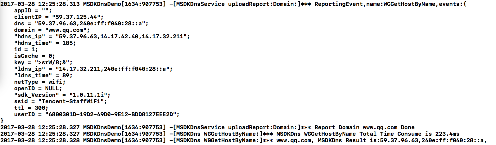

# SDK是否接入成功验证方法 -- iOS #
----
### 一、打开Debug日志开关

有两种方法可打开HttpDns Debug日志开关：

1. 在项目工程的info.plist中进行如下配置：

	| Key        | Type           | Value  |
	| ------------- |-------------| -------------|
	| Debug | Boolean | YES |

2. 调用接口 **[[MSDKDns sharedInstance] WGOpenMSDKDnsLog:YES]**，接口说明如下：

		/**
		 *  Log开关
		 *  @param enabled YES:打开 NO:关闭
		 */
		- (void) WGOpenMSDKDnsLog:(BOOL) enabled;

### 二、检查解析结果

搜索日志关键字：**ReportingEvent,name:WGGetHostByName,events:**

 

如上图，如果ldns\_ip和hdns\_ip都有解析结果，则说明接入成功。

如果确认没有问题，建议在正式上线前关闭debug日志，以降低网络或性能开销

### 三、其它异常问题处理

1. **hdns\_ip解析没有结果**：

	- 按照github上接入文档中配置说明进行检查，尤其内外部厂商（IS\_COOPERATOR）和是否开启测试环境（IS\_TEST）配置；

	- 如果info.plist配置没有问题，建议尝试切换网络环境再测试一下，如由wifi切换到4G；

	- 如果还是不行，可以使用如下方法进行网络环境监测，将www.qq.com更换为业务的域名进行测试：
	
		- 腾讯业务（含代理或合作）：http://182.254.116.117/d?dn=www.qq.com
		- 非腾讯业务：http://119.29.29.29/d?dn=www.qq.com
	
	- 如果按照以上两种方法还是无法获取hdns\_ip的结果，请检查一下自己当前的网络环境，是否有做出口限制等。
